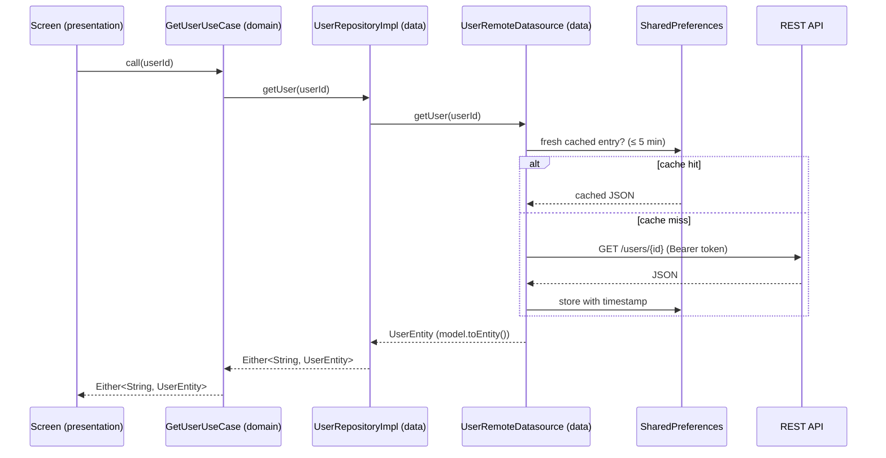

# CH4NGE

A cross-platform **Flutter** app that turns everyday eco-friendly habits into a game. Log green
actions, earn points, take on weekly and mini challenges, climb the leaderboard, and explore
greenhouse-gas (GHG) data on an interactive heatmap. One Dart codebase runs on **Android, iOS,
web, and desktop (Linux, macOS, Windows)**.

---

## Architecture

CH4NGE follows **Clean Architecture** organised **feature-first**. The codebase is split into three
concentric layers plus a shared infrastructure core. The guiding constraint is the **Dependency
Rule**: source-code dependencies point *inwards only*. Inner layers know nothing about the layers
outside them.

```
presentation  ─────▶  domain  ◀─────  data
   (Flutter)         (pure Dart)      (I/O, JSON, cache)
                         ▲
                         │  depends on
                        core  (DI · network · auth · config)
```

- **`domain/`** is pure Dart. It has **no Flutter and no `dio` imports** — it defines *what* the app
  does, never *how*.
- **`data/`** implements the domain's contracts and deals with the messy outside world: HTTP, JSON
  (de)serialisation, and caching.
- **`presentation/`** renders state and dispatches intent. It depends on the domain through use
  cases, never on the data layer directly.

Each layer talks to the next only through **abstract interfaces**: the presentation layer depends on
domain use cases, and repository implementations in the data layer are bound to their domain
contracts at the composition root (see *Dependency injection* below).

### The layers

#### Domain — the business core (no dependencies)

The innermost layer. It holds the rules and contracts and depends on nothing but pure Dart.

- **Entities** (`domain/entities/`, 10 files) — plain, immutable domain objects such as `UserEntity`,
  `PostEntity`, `ActivityEntity`, and the `action/` hierarchy (`ActionEntity`, `GreenEntity`,
  `TransportationEntity`). They carry `copyWith` and zero serialisation logic — JSON is a data-layer
  concern, not a domain one.
- **Repository interfaces** (`domain/repositories/`, 8 contracts) — abstract definitions like
  `UserRepository` and `PostRepository` that declare *what* data operations exist, expressed purely
  in domain terms.
- **Use cases** (`domain/use_cases/`, 17) — one class per application action, each a single-method
  `call()` object: `GetUserUseCase`, `UploadActionUseCase`, `LikePostUseCase`,
  `GetWeeklyChallengeUseCase`, and so on. Use cases are the only entry point the UI is allowed to
  touch, which keeps business logic out of widgets. Some **compose** other collaborators — e.g.
  `GetPostsUseCase` pulls recent posts, then enriches each one with its author via the
  `UserRepository`, so the UI receives fully-hydrated data in a single call.

#### Data — the outside world

Implements the domain contracts and isolates all I/O. Three sub-roles:

- **Models / DTOs** (`data/models/`, 12 hand-written files) — built with
  [`freezed`](https://pub.dev/packages/freezed) + [`json_serializable`](https://pub.dev/packages/json_serializable)
  for immutable, code-generated data classes. Each model owns the boundary mapping explicitly:
  `fromJson` / `toJson` for the wire, and **`fromEntity` / `toEntity`** to convert to and from the
  domain. The domain never sees a JSON map; the UI never sees a DTO.
- **Datasources** (`data/datasources/`, 8) — each defined as an interface (`IUserDatasource`) with a
  remote implementation (`UserRemoteDatasource`). They own the actual HTTP calls **and an
  offline-first cache** (see *Caching* below).
- **Repository implementations** (`data/repositories/`, 8) — `UserRepositoryImpl` etc. implement the
  domain interfaces, delegate to datasources, and wrap every result in an **`Either`**, so failures
  are returned as values rather than thrown across layers.

#### Presentation — Flutter UI

Organised by feature screen (`presentation/screens/`): `authentication`, `home`, `challenges`,
`feed`, `leaderboard`, `map`, `settings` — each with its own `widgets/`, plus a set of shared
widgets (`custom_appbar`, `custom_navbar`, `draggable_bottomsheet`, `countdown_timer`, …).

Two state-handling strategies coexist, chosen per screen:

- **BLoC** ([`flutter_bloc`](https://pub.dev/packages/flutter_bloc)) for authentication — `AuthBloc`
  maps `AuthEvent`s (`AuthLoginRequest`, `AuthRegisterRequest`, `AuthLogoutRequest`) to `AuthState`s
  (`AuthInitState` → `AuthLoadingState` → `AuthRequestSuccessState`), modelling auth as an explicit
  state machine.
- **Constructor-injected use cases** for the data-driven screens — each page receives exactly the
  use cases it needs, resolved from the service locator at route-build time, and manages its own
  view state. The dependencies a screen has are visible in its constructor signature.

#### Core — shared infrastructure (`lib/core/`)

Cross-cutting plumbing used by every feature:

| Module | Responsibility |
| --- | --- |
| `di/service_locator.dart` | [`get_it`](https://pub.dev/packages/get_it) composition root — wires the whole object graph |
| `network/network_client.dart` | `dio` client + interceptors (auth-token injection, `401` → logout, logging) |
| `api/api_service.dart` | Thin generic REST wrapper (`get`/`post`/`put`/`delete`) that maps `DioException` → `ApiException` |
| `auth/auth_manager.dart` | Token / session store over `shared_preferences`, with a `ValueNotifier` for reactive auth changes |
| `shared/config.dart` | Environment config read from `.env` via [`flutter_dotenv`](https://pub.dev/packages/flutter_dotenv) |
| `utils/exception.dart` | `ApiException` with user-friendly message refinement |

### How a request flows through the layers

A read such as "load this user" travels inward → outward → back, crossing each boundary exactly once:



The UI receives an `Either<String, UserEntity>` — a `Left` carrying a message to show, or a `Right`
carrying a mapped domain entity. Whether the data came from the network or the cache is resolved
inside the datasource and not exposed to the caller.

### Cross-cutting design decisions

The notable implementation choices across the codebase:

- **Typed error handling with `Either`.** Repositories return
  `Either<String, T>` ([`either_dart`](https://pub.dev/packages/either_dart)) instead of throwing
  across layers. Failure is part of the return type, so each caller handles the `Left` (message) and
  `Right` (value) branches explicitly.
- **Dependency injection with per-dependency lifecycles.** The `get_it` composition root registers
  each dependency with a chosen lifetime: **singletons** for stateful infrastructure (`Config`,
  `NetworkClient`, `SharedPreferences`), **lazy singletons** for repositories and the `AuthBloc`
  (created once, on first use), and **factories** for datasources and use cases (a new instance per
  call). The graph is assembled in one place and awaited (`serviceLocator.allReady()`) before the app
  starts.
- **Offline-first caching (stale-while-error).** Datasources cache responses in `SharedPreferences`
  with a timestamp and a **5-minute TTL**. Fresh cache short-circuits the network; on a network
  failure the datasource falls back to stale cache rather than erroring; and writes that mutate data
  (profile picture, friends) invalidate the affected cache keys.
- **Centralised networking via interceptors.** A single `dio` interceptor injects the bearer token
  and standard headers on every request and logs the user out on a `401`, keeping auth handling in
  one place.
- **Declarative, platform-aware navigation.** [`go_router`](https://pub.dev/packages/go_router)
  defines routes declaratively and injects each screen's use cases at build time. A custom
  `buildPageWithTransition` helper applies **iOS-native transitions** (cupertino / slide / fade /
  scale) on Apple platforms and standard Material transitions on Android.
- **Environment-based configuration.** `.env.dev` loads in debug and `.env.prod` in release, so the
  API base URL and secrets never get hard-coded or committed.
- **Deep linking** via [`app_links`](https://pub.dev/packages/app_links) in the feed, and
  **responsive sizing** via [`flutter_screenutil`](https://pub.dev/packages/flutter_screenutil) for
  consistent layout across device sizes.

---

## Features

- **Authentication** — sign-up / sign-in with token-based session handling, driven by a BLoC state machine.
- **Actions** — log eco-friendly activities (green + transportation) and track your impact.
- **Challenges & achievements** — weekly challenges, mini challenges, and unlockable achievements with progress tracking.
- **Feed** — a social feed to post, like, and share activity, with deep-link support.
- **Leaderboard** — compete on points and climb the rankings.
- **Map** — interactive map with a GHG **heatmap** over environmental sensor data and friends' activity.
- **Settings** — manage your profile (including profile-picture upload) and preferences.

---

## Project structure

```
lib/
├── core/                         # Shared infrastructure (framework-agnostic plumbing)
│   ├── api/                      #   generic REST wrapper (ApiService)
│   ├── auth/                     #   AuthManager — token/session store
│   ├── network/                  #   dio client + interceptors
│   ├── di/                       #   get_it composition root
│   ├── shared/                   #   Config (dotenv)
│   └── utils/                    #   ApiException, mappers, validators
│
├── features/layers/
│   ├── domain/                   # ← innermost: pure business rules, no Flutter
│   │   ├── entities/             #   immutable domain objects
│   │   ├── repositories/         #   abstract contracts (interfaces)
│   │   └── use_cases/            #   one action per class (call())
│   │
│   ├── data/                     # ← implements domain contracts; all I/O lives here
│   │   ├── models/               #   freezed/json DTOs + entity mappers
│   │   ├── datasources/          #   remote I/O + offline cache
│   │   └── repositories/         #   repository implementations (Either)
│   │
│   └── presentation/             # ← outermost: Flutter UI
│       ├── screens/              #   feature screens (auth, home, challenges,
│       │                         #   feed, leaderboard, map, settings)
│       └── widgets/              #   shared UI components
│
└── main.dart                     # entrypoint: env load → DI setup → go_router
```

---

## Tech stack

- **Framework:** Flutter (Dart SDK `^3.6.1`)
- **Architecture:** Clean Architecture (domain / data / presentation) + Repository pattern
- **State management:** [`flutter_bloc`](https://pub.dev/packages/flutter_bloc)
- **Routing:** [`go_router`](https://pub.dev/packages/go_router)
- **Dependency injection:** [`get_it`](https://pub.dev/packages/get_it)
- **Networking:** [`dio`](https://pub.dev/packages/dio) / [`http`](https://pub.dev/packages/http)
- **Error handling:** [`either_dart`](https://pub.dev/packages/either_dart)
- **Models / codegen:** [`freezed`](https://pub.dev/packages/freezed), [`json_serializable`](https://pub.dev/packages/json_serializable)
- **Maps:** [`flutter_map`](https://pub.dev/packages/flutter_map), [`latlong2`](https://pub.dev/packages/latlong2), [`flutter_map_heatmap`](https://pub.dev/packages/flutter_map_heatmap)
- **Location:** [`geolocator`](https://pub.dev/packages/geolocator), [`location`](https://pub.dev/packages/location)
- **Storage:** [`shared_preferences`](https://pub.dev/packages/shared_preferences)
- **Config:** [`flutter_dotenv`](https://pub.dev/packages/flutter_dotenv) (`.env.dev` / `.env.prod`)
- **Other:** `flutter_screenutil`, `image_picker`, `share_plus`, `app_links`

---

## Getting started

### Prerequisites

- [Flutter SDK](https://docs.flutter.dev/get-started/install) (Dart `^3.6.1` or newer)
- A configured device, emulator, or browser

### Setup

1. Clone the repository:
   ```bash
   git clone https://github.com/Kamal578/CH4NGE_UI.git
   cd CH4NGE_UI
   ```

2. Install dependencies:
   ```bash
   flutter pub get
   ```

3. Create the environment files in the project root (required, not committed):

   `.env.dev`
   ```env
   ENDPOINT_URL=https://your-dev-api-url
   ```

   `.env.prod`
   ```env
   ENDPOINT_URL=https://your-prod-api-url
   ```

4. Generate code for `freezed` / `json_serializable` models:
   ```bash
   dart run build_runner build --delete-conflicting-outputs
   ```

5. Run the app:
   ```bash
   flutter run
   ```

The app loads `.env.dev` in debug mode and `.env.prod` in release builds.

## Build

```bash
flutter build apk        # Android
flutter build ios        # iOS
flutter build web        # Web
flutter build macos      # macOS
flutter build windows    # Windows
flutter build linux      # Linux
```

---

## Author

**Kamal Ahmadov** ([@Kamal578](https://github.com/Kamal578))
